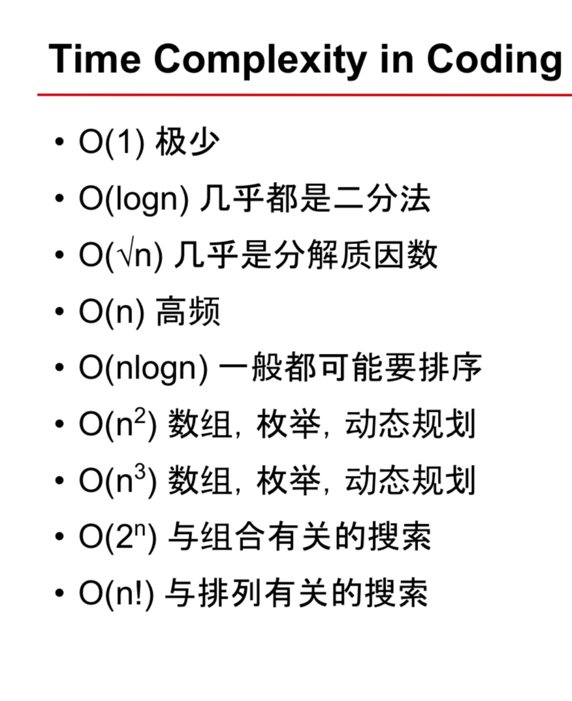

# jobPreparation
LeetCode/LintCode solutions in Java
Reference to Jerry's git https://github.com/liangchiwuu/leetcode

## Algorithms

★ indicates critical problems, IMO.  
☆ indicates LeetCode subscribers only.  
L indidates Ladder from LintCode questions.  

| |#|Source|Difficulty|Problem|Solution|Tag| 
|-|-|-|----------|-------|--------|---|
|★|1|LeetCode|Easy|[Two Sum](https://leetcode.com/problems/two-sum/)|[Java](./algorithms/TwoSum.java)|Hash|
||3|LeetCode|Medium|[Longest Substring Without Repeating Characters](https://leetcode.com/problems/longest-substring-without-repeating-characters/description/)|[Java](./algorithms/
||5|LeetCode|Medium|[Longest Palindromic Substring](https://leetcode.com/problems/longest-substring-without-repeating-characters/description/)|[Java](./algorithms/LongestPalindromicSubstring.java)|String|
|★|7|LeetCode|Medium|[Serialize and Deserialize Binary Tree](https://www.lintcode.com/problem/binary-tree-serialization/description)|[Java](./algorithms/SerializeAndDeserializeBinaryTree.java)|BFS,DFS|
||10|LeetCode|Medium|[String Permutation II](https://www.lintcode.com/problem/string-permutation-ii/description)|[Java](./algorithms/StringPermutationII.java)|DFS|
||10|LeetCode|Medium|[MinStack](https://www.lintcode.com/problem/min-stack/description)|[Java](./algorithms/MinStack.java)|Stack|
||14|LintCode|Easy|[First Position of Target ](https://www.lintcode.com/en/problem/first-position-of-target/)|[Java](./algorithms/FirstPositionOfTarget.java)|Binary Search|
||15|LintCode|Medium|[Permutations](https://www.lintcode.com/problem/permutations/description)|[Java](./algorithms/Permutations.java)|DFS|
||16|LintCode|Medium|[Permutations2](https://www.lintcode.com/problem/permutations-ii/description)|[Java](./algorithms/Permutations2.java)|DFS|
||17|LintCode|Medium|[Subsets](https://www.lintcode.com/problem/subsets/description)|[Java](./algorithms/Subsets.java)|DFS|
||18|LintCode|Medium|[Subsets2](https://www.lintcode.com/problem/subsets/description)|[Java](./algorithms/Subsets2.java)|DFS|
||20|LintCode|Easy|[Valid Parentheses](https://leetcode.com/problems/valid-parentheses/description/)|[Java](./algorithms/ValidParentheses.java)|String, Stack|
|L|28/13|LeetCode/LintCode|Easy|[strStr](https://leetcode.com/problems/implement-strstr/description/)|[Java](./algorithms/strStr.java)|String|
|L|33|LintCode|Medium|[N-Queens](https://www.lintcode.com/problem/n-queens/description)|[Java](./algorithms/N-Queens.java)|DFS|
|L|34|LintCode|Medium|[N-Queens II](https://www.lintcode.com/problem/n-queens/description)|[Java](./algorithms/N-Queens2.java)|DFS|
||40|LintCode|Medium|[Implement Queue by Two Stacks](https://www.lintcode.com/problem/implement-queue-by-two-stacks/description)|[Java](./algorithms/ImplementQueuebyTwoStacks.java)|DFS|
||57|LintCode|Easy|[ThreeSum](https://www.lintcode.com/problem/3sum/description)|[Java](./algorithms/ThreeSum.java)|Two Pointer|
|★|66|LintCode|Medium|[Binary Tree Preorder Traversal](https://www.lintcode.com/problem/binary-tree-preorder-traversal/description)|[Java](./algorithms/BinaryTreePreorderTraversal.java)|Binary Tree, Divide and Conquer, DFS|
|★|67|LintCode|Medium|[Binary Tree Inorder Traversal](https://www.lintcode.com/problem/binary-tree-inorder-traversal/description)|[Java](./algorithms/BinaryTreeInorderTraversal.java)|Binary Tree, Divide and Conquer, DFS|
||68|LintCode|Medium|[Binary Tree Postorder TraversalB](https://www.lintcode.com/problem/binary-tree-postorder-traversal/description)|[Java](./algorithms/BinaryTreePostorderTraversal.java)|Binary Tree, Divide and Conquer, DFS|
|★|69|LintCode|Medium|[Binary Tree Level Order Traversal](www.lintcode.com/problem/binary-tree-level-order-traversal/description)|[Java](./algorithms/SerializeAndDeserializeBinaryTree.java)|BFS|
||70|LintCode|Medium|[Binary Tree Level Order Traversal II](https://www.lintcode.com/problem/binary-tree-level-order-traversal-ii/description)|[Java](./algorithms/SerializeAndDeserializeBinaryTree2.java)|BFS|
||71|LintCode|Medium|[Binary Tree Zigzag Level Order Traversal](https://www.lintcode.com/problem/binary-tree-zigzag-level-order-traversal/description)|[Java](./algorithms/BinaryTreeZigzagLevelOrderTraversal.java)|BFS|
||74|LintCode|Medium|[First Bad Version](https://www.lintcode.com/en/problem/first-bad-version/)|[Java](./algorithms/FirstBadVersion.java)|Binary Search|
||88|LintCode|Medium|[Lowest Common Ancestor of a Binary Tree](https://www.lintcode.com/problem/lowest-common-ancestor/description)|[Java](./algorithms/LowestCommonAncestorofaBinaryTree.java)|Binary Search Tree|
||93|LintCode|Medium|[Balanced Binary Tree](https://www.lintcode.com/problem/balanced-binary-tree/description)|[Java](./algorithms/BalancedBinaryTree.java)|Divided and conquer|
||95|LintCode|Medium|[Validate Binary Search Tree](https://www.lintcode.com/problem/validate-binary-search-tree/description)|[Java](./algorithms/Validate BinarySearchTree.java)|Divided and conquer, traverse, BST|
||97|LintCode|Easy|[Maximum Depth of Binary Tree](https://www.lintcode.com/problem/maximum-depth-of-binary-tree/description)|[Java](./algorithms/MaximumDepthofBinaryTree.java)|Tree, Divide and Conquer, Travese|
||107|LintCode|Medium|[Word Break](https://www.lintcode.com/problem/word-break/description)|[Java](./algorithms/WordBreak.java)|DP|
|L|125/415|LeetCode/LintCode|Easy|[Valid Palindrome](https://leetcode.com/problems/valid-palindrome/description/)|[Java](./algorithms/ValidPalindrome.java)|Two Pointers|
|★|120|LintCode|Medium|[Word Ladder](https://www.lintcode.com/problem/word-ladder/description)|[Java](./algorithms/WordLadder.java)|BFS, DFS|
|★|127|LintCode|Medium|[Topological Sorting](https://www.jiuzhang.com/solution/topological-sorting/)|[Java](./algorithms/TopologicalSorting.java)|BFS, DFS|
|L|130|LintCode|Medium|[Heapify](https://www.lintcode.com/problem/heapify/description)|[Java](./algorithms/Heapify.java)|Heap|
||136|LintCode|Medium|[Palindrome Partitioning](https://www.lintcode.com/problem/palindrome-partitioning/description)|[Java](./algorithms/PalindromePartitioning.java)|BFS, DFS|
|L|137|LintCode|Medium|[Clone Graph](https://www.lintcode.com/problem/clone-graph/description)|[Java](./algorithms/CloneGraph.java)|BFS, DFS|
|L|140|LintCode|Medium|[Fast Power](https://www.lintcode.com/en/problem/fast-power/)|[Java](./algorithms/FastPower.java)|Binary Search|
|L|152|LintCode|Medium|[Combinations](https://www.lintcode.com/problem/combinations/description)|[Java](./algorithms/Combinations.java)|DFS|
||167|LeetCode|Easy|[Two Sum II](https://leetcode.com/problems/two-sum-ii-input-array-is-sorted/description/)|[Java](./algorithms/TwoSumII.java)|Two Pointers|
||196|LintCode|Medium|[Missing Number](https://www.lintcode.com/problem/missing-number/description)|[Java](./algorithms/MissingNumber.java)|Math|
||170/607|LeetCode/LintCode|Easy|[Two Sum III](https://www.lintcode.com/en/problem/two-sum-iii-data-structure-design/)|[Java](./algorithms/TwoSumIII.java)|Two Pointers|
||175|LintCode|Easy|[Invert Binary Tree](https://www.lintcode.com/problem/invert-binary-tree/description)|[Java](./algorithms/InvertBinaryTree.java)|Binary tree|
||178|LintCode|Medium|[Graph Valid Tree](https://www.lintcode.com/problem/graph-valid-tree/description)|[Java](./algorithms/GraphValidTree.java)|BFS, DFS, Union Find|
||200|LeetCode|Medium|[Longest Palindromic Substring](https://www.lintcode.com/problem/longest-palindromic-substring/description)|[Java](./algorithms/PalindromicSubstrings.java)|String, Dynamic Programming|
||206|LeetCode|Easy|[Reverse Linked List](https://leetcode.com/problems/reverse-linked-list/description/)|[Java](./algorithms/reverseList.java)| Pointers|
||211|LeetCode|Easy|[String Permutation](https://www.lintcode.com/problem/string-permutation/description)|[Java](./algorithms/reverseList.java)| Pointers|
|L|228|LeetCode|Naive|[Middle of Linked List](https://www.lintcode.com/problem/middle-of-linked-list/description)|[Java](./algorithms/MiddleOfLinkedList.java)|Two Pointers|
|L|242|LeetCode|Easy|[Convert Binary Tree to Linked Lists by Depth](https://www.lintcode.com/problem/convert-binary-tree-to-linked-lists-by-depth/description)|[Java](./algorithms/ConvertBinaryTreetoLinkedListsbyDepth.java)|BFS|
|L|409/627|LeetCode/LintCode|Easy|[Longest Palindrome](https://www.lintcode.com/en/problem/longest-palindrome/)|[Java](./algorithms/LongestPalindrome.java)|Hash|
||344|LeetCode|Easy|[Reverse String](https://leetcode.com/problems/reverse-string/description/)|[Java](./algorithms/ReverseString.java)|Two Pointers, String|
|★|349|LeetCode|Easy|[Intersection of Two Arrays](https://leetcode.com/problems/intersection-of-two-arrays/description/)|[Java](./algorithms/IntersectionOfTwoArrays.java)|Two Pointers, Set|
|★|350|LeetCode|Easy|[Intersection of Two ArraysII](https://leetcode.com/problems/intersection-of-two-arrays-ii/description/)|[Java](./algorithms/IntersectionOfTwoArraysII.java)|Two Pointers, Set|
||378|LintCode|Medium|[Convert Binary Search Tree to Doubly Linked List](https://www.lintcode.com/problem/convert-binary-search-tree-to-doubly-linked-list/description)|[Java](./algorithms/ConvertBinarySearchTreetoDoublyLinkedList.java)|BST, linked list|
|★|413|LintCode|Easy|[Two Sum](https://www.lintcode.com/problem/reverse-integer/description)|[Java](./algorithms/ReverseInteger.java)|Math|
|L|428|LintCode|Medium|[Pow(x, n)](https://www.lintcode.com/en/problem/powx-n/)|[Java](./algorithms/Powx-n.java)|Binary Search|
|L|447|LintCode|Medium|[Search in a Big Sorted Array](https://www.lintcode.com/en/problem/search-in-a-big-sorted-array/)|[Java](./algorithms/SearchInABigSortedArray.java)|Binary Search|
||452|LintCode|Medium|[Letter Combinations of a Phone Number](https://www.lintcode.com/problem/letter-combinations-of-a-phone-number/description)|[Java](./algorithms/LetterCombinationsPhoneNumber.java)|BST,DFS|
||453|LintCode|Medium|[Flatten Binary Tree to Linked List](https://www.lintcode.com/problem/flatten-binary-tree-to-linked-list/description)|[Java](./algorithms/FlattenBinaryTreetoLinkedList.java)|BST and LinkedList|
||457|LintCode|Easy|[Classical Binary Search](https://www.lintcode.com/en/problem/classical-binary-search/)|[Java](./algorithms/ClassicalBinarySearch.java)|Binary Search|
|L|458|LintCode|Easy|[Last Position of Target](https://www.lintcode.com/en/problem/last-position-of-target/)|[Java](./algorithms/LastPositionOfTarget.java)|Binary Search|
||460|LintCode|Medium|[Find K Closest Elements](https://www.lintcode.com/problem/find-k-closest-elements/description)|[Java](./algorithms/findkClosestElements.java)|Heap|
||474|LintCode|Medium|[Lowest Common Ancestor II](https://www.lintcode.com/problem/lowest-common-ancestor-ii/description)|[Java](./algorithms/LowestCommonAncestorII.java)|Binary Search Tree|
||477|LintCode|Medium|[Combination Sum](https://www.lintcode.com/problem/combination-sum/description)|[Java](./algorithms/findkClosestElements.java)|DFS|
||491|LintCode|Easy|[Palindrome Number](https://www.lintcode.com/problem/palindrome-number/description)|[Java](./algorithms/alindromeNumber.java)|Math|
||494|LintCode|Easy|[Implement Stack by Two Queues](https://www.lintcode.com/problem/implement-stack-by-two-queues/description)|[Java](./algorithms/ImplementStackbyTwoQueues.java)|Stack|
||495|LintCode|Easy|[Implement Stack](https://www.lintcode.com/problem/implement-stack/description)|[Java](./algorithms/ImplementStack.java)|Stack|
|L|521|LintCode|Easy|[Remove Duplicate Numbers In Array](https://www.lintcode.com/problem/remove-duplicate-numbers-in-array/description)|[Java](./algorithms/RemoveDuplicateNumbersInArray.java)|Set, Sort|
||570|LintCode|Medium|[Find the Missing Number II](https://www.lintcode.com/problem/find-the-missing-number-ii/description)|[Java](./algorithms/FindtheMissingNumberII.java)|dfs|
||578|LintCode|Medium|[Lowest Common Ancestor III](https://www.lintcode.com/problem/lowest-common-ancestor-iii/description)|[Java](./algorithms/LowestCommonAncestorIII.java)|Binary Search Tree|
||582|LintCode|Medium|[Word Break II](https://www.lintcode.com/problem/word-break-ii/description)|[Java](./algorithms/WordBreakII.java)|DFS, Divide and Conquer|
||596|LintCode|Easy|[Minimum Subtree](https://www.lintcode.com/problem/minimum-subtree/description)|[Java](./algorithms/MinimumSubtree.java)|Divide and Conquer|
||597|LintCode|Easy|[Subtree with Maximum Average](https://www.lintcode.com/problem/subtree-with-maximum-average/description)|[Java](./algorithms/SubtreewithMaximumAverage.java)|Divide and Conquer|
||598|LintCode|Medium|[Zombie in Matrix](https://www.lintcode.com/problem/zombie-in-matrix/description)|[Java](./algorithms/ZombieInMatrix.java)|BFS|
||604|LintCode|Easy|[Window Sum](https://www.lintcode.com/problem/window-sum/description)|[Java](./algorithms/WindowSum.java)|Two Pointers|
|★L|605|LintCode|Medium|[Sequence Reconstruction](https://www.lintcode.com/problem/sequence-reconstruction/description)|[Java](./algorithms/SequenceReconstruction.java)|BFS, Topological Sort|
|L|611|LintCode|Medium|[Knight Shortest Path](https://www.lintcode.com/problem/knight-shortest-path/description)|[Java](./algorithms/KnightShortestPath.java)|BFS|
|★L|612|LintCode|Medium|[K Closest Points](https://www.lintcode.com/en/old/problem/k-closest-points/)|[Java](./algorithms/KClosestPoints.java)|Priority Queue|
|★L|615|LintCode|Medium|[Course Schedule](https://www.lintcode.com/problem/course-schedule/description)|[Java](./algorithms/CourseSchedule.java)|BFS|
|★L|616|LintCode|Medium|[Course Schedule II](https://www.lintcode.com/problem/course-schedule-ii/description)|[Java](./algorithms/CourseScheduleII.java)|BFS|
||618|LintCode|Medium|[Search Graph Nodes](https://www.lintcode.com/problem/search-graph-nodes/description)|[Java](./algorithms/SearchGraphNodes.java)|BFS|
||624|LintCode|Medium|[Remove Substrings](https://www.lintcode.com/problem/remove-substrings/description)|[Java](./algorithms/RemoveSubstrings.java)|BFS, String|
|★|647|LeetCode|Medium|[Palindromic Substrings](https://leetcode.com/problems/palindromic-substrings/description/)|[Java](./algorithms/PalindromicSubstrings.java)|Two Pointers, DP|
||780|LeetCode|Hard|[Remove Invalid Parentheses](https://www.lintcode.com/problem/remove-invalid-parentheses/description)|[Java](./algorithms/RemoveInvalidParentheses.java)|DFS|
||862|LintCode|Medium|[Next Closest Time](https://www.lintcode.com/problem/next-closest-time/description)|[Java](./algorithms/NextClosestTime.java)|DFS, String|
||900|LintCode|Easy|[Closest Binary Search Tree Value](https://www.lintcode.com/problem/closest-binary-search-tree-value/description)|[Java](./algorithms/ClosestBinarySearchTreeValue.java)|BST, traverse|
||901|LintCode|Hard|[Closest Binary Search Tree Value](https://www.lintcode.com/problem/closest-binary-search-tree-value-ii/description)|[Java](./algorithms/ClosestBinarySearchTreeValueII.java)|BST, traverse|
||902|LintCode|Medium|[Kth Smallest Element in a BST](https://www.lintcode.com/problem/kth-smallest-element-in-a-bst/description)|[Java](./algorithms/KthSmallestElementinaBST.java)|BST, traverse|


## Handy Java Syntax

### Array length  
int[] nums = {10,20}  
int [] hashData = new int [256];  
Arrays.sort(nums);  
Arrays.sort(nums, Collections.reverseOrder());  
for (int left = 0; left < nums.length; left++)  

### String length()  
s.length()  
for (char c : s.toCharArray())  
  
### List size()  
ArrayList<Integer> arrli = new ArrayList<Integer>();  
arrli.add(i);  
arrli.subList(a,b);  
arrli.remove(index);  
for (int i=0; i < arrli.size(); i++)  
Collections.sort(arrli);   
Collections.sort(arraylist, Collections.reverseOrder());  
Collections.reverse(arrli);  

### Map size()  
Map<Integer, Boolean> mp = new HashMap<Integer, Boolean>();  
mp.size()  
mp.put(nums[i], true);   
mp.remove(key);  
for (Map.Entry<Integer, Boolean> entry : mp.entrySet())  

### Set size()  
Set <Integer> sets = new HashSet<Integer>();  
set.size();  
set.remove(object);  
sets.add(nums[left]);   
for (Integer data : sets)  

### Queue size()  
常用queue operations  
Queue<TreeNode> queue = new LinkedList<>();  
queue.offer(root);  
!queue.isEmpty()  
int size = queue.size();  
TreeNode data = queue.poll(); 

### StringBuilder
StringBuilder results = new StringBuilder();  
results.append("a");  
// delete  
results.setLength(results.length() - removeCount);  
results.toString();  
### Binary Search Tree
从定义出发:
• 左子树都比根节点小
• 右子树都不小于根节点

从效果出发:
• 中序遍历 in-order traversal 是“不下降”序列 (ascending order)
• 中序遍历为12345

如果一棵二叉树的中序遍历 **不是** ascending order 序列，则一定不是BST
例如: 12435

如果一棵二叉树的中序遍历是不下降，也未必是BST
例如: 111111

### Graph
```
// 怎么表示 graph
Map<Integer, Set<Integer>> graph = new HashMap<>();
// 怎么判断链接
graph.get(u).contains(x)
// loop 边
for(Integer neighbor: graph.get(u)){

}

```
### Heap and comparable
```java 
// Max heap
PriorityQueue<Integer> maxHeap = new PriorityQueue<Integer>(k,new Comparator<Integer>(){
        @Override
        public int compare(Integer a, Integer b){
            // if dist > 0, swap a and b
            int dist = Math.abs(b-target) - Math.abs(a-target);
            // if b > a, return postive, then swap b and a
            if(dist == 0){
                return b - a;
            }
            return dist;
        }
    });

for(int num: A){
        maxHeap.offer(num);
        if(maxHeap.size() > k){
            maxHeap.poll(); // pull largest, left cloest  
        }
    }
```
Height = log(k)
n = num of elements  
k = num of elements in the PQ   

O(log k) time for the enqueing and dequeing methods (offer, poll, remove() and add) => O(n * log k)  => need relocatio and shift
O(k) for the remove(Object) and contains(Object) methods need loop all elements    
O(1) for the retrieval methods (peek,pop, element, and size)  

### BFS
```java
// bfs 时间 O(e) where e = 边数 or O(m+n) = 边+点

 public List<List<Integer>> levelOrder(TreeNode root) {
       List<List<Integer>> results = new ArrayList<>();
       if(root == null){
           return results;
       }
       Queue<TreeNode> queue = new LinkedList<>();
       //1. 所有起点放入quque
       queue.offer(root);
       while(!queue.isEmpty()){
           //2. 根据当前拓展下一层
           List<Integer> curtLevel = new ArrayList<>();
           // take a snapshot
           int size = queue.size();
           for (int i = 0; i < size; i++){
                TreeNode data = queue.poll();
                curtLevel.add(data.val);
                
               if(data.left != null){
                   queue.offer(data.left);
               }
               if(data.right != null){
                   queue.offer(data.right);
               }
           }
           
           results.add(curtLevel);
       }
       
       return results;
}
```

```
/*
 无需分层遍历的宽度搜索
   1.neighbor 表示从某个点 head 出发，可以走到的下一层的节点。
   2.set 存储已经访问过的节点（已经丢到 queue 里去过的节点）
   3.queue 存储等待被拓展到下一层的节点
   4.set 与 queue 是一对好基友，无时无刻都一起出现，往 queue 里新增一个节点，就要同时丢到 set 里。
*/
Queue<T> queue = new LinkedList<>();
Set<T> set = new HashSet<>();

set.add(start);
queue.offer(start);
while (!queue.isEmpty()) {
    T head = queue.poll();
    for (T neighbor : head.neighbors) {
        if (!set.contains(neighbor)) {
            set.add(neighbor);
            queue.offer(neighbor);
        }
    }
}

```

```
/*
 需分层遍历的宽度搜索
 size = queue.size() 是一个必须的步骤。如果在 for 循环中使用 for (int i = 0; i < queue.size(); i++) 会出错，因为 queue.size() 是一个动态变化的值。所以必须先把当前层一共有多少个节点存在局部变量 size 中，才不会把下一层的节点也在当前层进行扩展。
*/

Queue<T> queue = new LinkedList<>();
Set<T> set = new HashSet<>();

set.add(start);
queue.offer(start);
while (!queue.isEmpty()) {
    // 重点
    int size = queue.size();

    for (int i = 0; i < size; i++) {
        T head = queue.poll();
        for (T neighbor : head.neighbors) {
            if (!set.contains(neighbor)) {
                set.add(neighbor);
                queue.offer(neighbor);
            }
        }
    }
}
```
### DFS
```
/*
搜索的时间复杂度：O(答案总数 * 构造每个答案的时间)

*排列*搜索问题 Permutation, N queue [1,2,3][1,3,2] ..
     时间复杂度:与 n! 相关。
     O(答案总数 * 构造每个答案的时间) = O(n! * n)

Permutations Example:
nums = [1,2,3] = 3 * 2 * 1 = 6 solutions
[
  [1,2,3],
  [1,3,2],
  [2,1,3],
  [2,3,1],
  [3,1,2],
  [3,2,1]
]

*组合*搜索问题 Combinations, Subset, Palindrome Partitioning (组合中的元素是顺序**无关**的)
     时间复杂度:与 2^n 相关。
     O(答案总数 * 构造每个答案的时间) = O(2^n * n)

Palindrome Partitioning （n-1）个字母组合的切割问题 example:
    Special case
    aaaaaaaaaaaaa
    => search 2^n

    Given s = "aab", return:
    [
      ["aa","b"],
      ["a","a","b"]
    ]

Combinations example:
    Given candidate set [10,1,6,7,2,1,5] and target 8,
    [
      [1,7],
      [1,2,5],
      [2,6],
      [1,1,6]
    ]

Subsets example:
    [1,2,3]  = 2 ^ 3 = 8 solutions
    [
      [3],
      [1],
      [2],
      [1,2,3],
      [1,3],
      [2,3],
      [1,2],
      []
    ]

Combinations:


dfs 递归方法
1. 递归的定义 
2. 递归的拆解
3. 递归的出口


*/
    public List<List<Integer>> subsetsWithDup(int[] nums) {
      List<List<Integer>> results = new ArrayList<>();
      if(nums == null){
          return results;
      }
      if(nums.length == 0){
          results.add(new ArrayList<Integer>());
          return results;
      }
      // sort the list for duplication
      Arrays.sort(nums);
      List<Integer> subset = new ArrayList<Integer>();
      // dfs
      helper(nums,0,results, subset);
      
      return results;
    }
    // 递归的定义 
    void helper(int[] nums, int startIndex, List<List<Integer>> results,List<Integer> subset ){
         //deep copy
         //递归的出口
         results.add(new ArrayList<Integer>(subset));
         //递归的拆解
         for(int i = startIndex; i < nums.length; i++){
               if(i != startIndex && nums[i-1] == nums[i]){
                  continue;
                   
               }
               subset.add(nums[i]);
               helper(nums, i + 1,results, subset);
               subset.remove(subset.size() - 1);
         }   
    }
}
```

### Traverse vs Divide Conquer vs DFS
Common: They are both Recursion Algorithm , they all DFS， all can be done with no recursion
Diff: 1. Result in parameter (小本本) vs Result in return value (手下的结果) 
      2. Top down (小人由上往下去记录) vs Bottom up (答案由下往上组合靠手下)
#### Code difference:
```
   /*
        Traverse遍历法, 小人拿本子去记录， 所以help 没有 return 东西
        O(n)     
    */
    public List<Integer> preorderTraversal(TreeNode root) {
        List<Integer> results = new ArrayList<>();
        if(root == null){
            return results;
        }
       helper(root, results);
       return results;
    }
    // 递归的定义，把root 为根的preorder 加入results 里面
    private void helper(TreeNode root,List<Integer> results){
        // 递归的出口
        if(root == null){
            return;
        }
        // 递归的分解 => 根左右
        results.add(root.val);
        helper(root.left,results);
        helper(root.right,results);
    }

###############################################################
     # Divide && Conquer, 让手下去解决，最后再合起来
     public List<Integer> preorderTraversal(TreeNode root) {
        List<Integer> results = new ArrayList<>();
        if(root == null){
            return results;
        }
        // divide
        List<Integer> left = preorderTraversal(root.left);
        List<Integer> right = preorderTraversal(root.right);
       
        // 根左右
        // Conquer
        results.add(root.val);
        results.addAll(left);
        results.addAll(right);
        
       return results;
    }
```
### DP

## Time Complexity


常见的算法时间复杂度由小到大依次为：Ο(1)＜Ο(log2n)＜Ο(n)＜Ο(nlog2n)＜Ο(n2)＜Ο(n3)＜…＜Ο(2n)＜Ο(n!)

###
```
搜索的时间复杂度：O(答案总数 * 构造每个答案的时间)
举例：Subsets问题，求所有的子集。子集个数一共 2^n，每个集合的平均长度是 O(n) 的，所以时间复杂度为 O(n * 2^n)，同理 Permutations 问题的时间复杂度为：O(n * n!)

动态规划的时间复杂度：O(状态总数 * 计算每个状态的时间复杂度)
举例：triangle，数字三角形的最短路径，状态总数约 O(n^2) 个，计算每个状态的时间复杂度为 O(1)——就是求一下 min。所以总的时间复杂度为 O(n^2)

用分治法解决二叉树问题的时间复杂度：O(二叉树节点个数 * 每个节点的计算时间)
举例：二叉树最大深度。二叉树节点个数为 N，每个节点上的计算时间为 O(1)。总的时间复杂度为 O(N)

*(额外)空间复杂度不用包括输入和输出的部分

```
